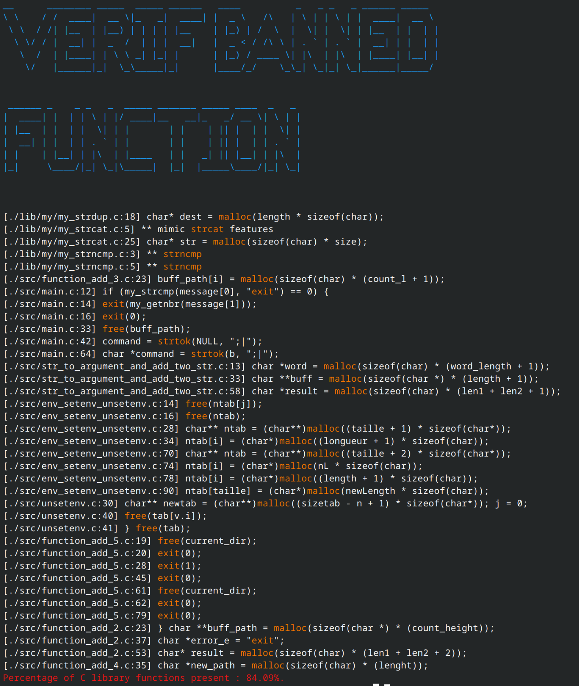

# Epitech banned functions tester tek1
this script allows you to detect the functions banned from the lib c. during your first year at epitech you will have to recreate your own utility functions, because for some epitech projects some functions of the standard lib c are banned. So it would be a shame to leave a simple debug printf in your code...


## how to use it ?

clone the repository

```bash
git clone https://github.com/ydhemtek/EpitechBanned.git
```

install

```bash
python3 setup.py install
```

launch

```bash
Example usage: python3 bannedtek.py /path/to/the/folder
```

### an ignored_function file allows you to skip the search for certain functions of the lib c

#### in ignored_function.txt :
```txt
malloc
strtok
strlen
...
```

## display



the script indicates the line where the functions used are located.